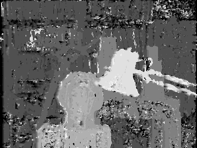
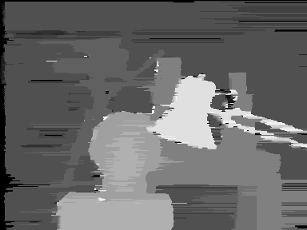
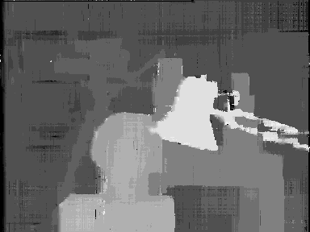
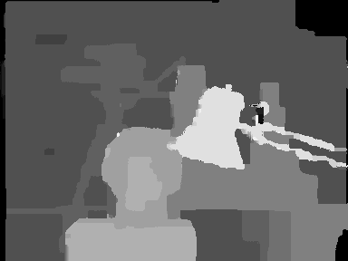
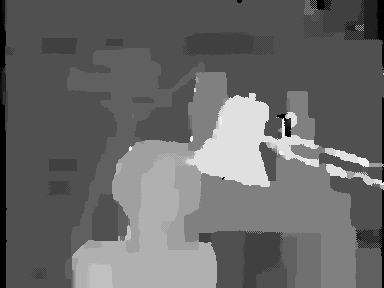

# Basic Stereo Algorithms (Evolution)

The basic stereoscopic algorithms have many similarities to each other and can be considered, in a way, that each algorithm is an evolution of another. In this project we created simplified forms of some basic stereoscopic algorithms in MATLAB and Python. The code has been adapted to show the improvement and evolution of an algorithm from the previous one. Compare the source code to see the improvements.

## Features

Stereo matching algorithms:

1. **Block Matching**
2. **Dynamic Programming**
3. **Semi-Global Matching**
4. **Belief Propagation (Directional)**
5. **Belief Propagation (Synchronous)**

Two different approaches to calculating smoothness costs.

All algorithms are implemented in both MATLAB and Python.

The algorithms are optimized for performance using matrix operations and other techniques.

## Algorithms

### Approach A
Uses a function to calculate the smoothness cost (BP-Like).

| Number | Name | MATLAB Implementation | Python Implementation |
| --- | --- | --- | --- |
| 1 | Block Matching | **[`stereo1_BM.m`](./matlab/stereo1_BM.m)** | **[`stereo1_BM.py`](./python/stereo1_BM.py)** |
| 2 | Dynamic Programming | **[`stereo2_DP.m`](./matlab/stereo2_DP.m)** | **[`stereo2_DP.py`](./python/stereo2_DP.py)** |
| 3 | Semi-Global Matching | **[`stereo3_SGM.m`](./matlab/stereo3_SGM.m)** | **[`stereo3_SGM.py`](./python/stereo3_SGM.py)** |
| 4 | Belief Propagation (Directional) | **[`stereo4_BP1.m`](./matlab/stereo4_BP1.m)** | **[`stereo4_BP1.py`](./python/stereo4_BP1.py)** |
| 5 | Belief Propagation (Synchronous) | **[`stereo5_BP2.m`](./matlab/stereo5_BP2.m)** | **[`stereo5_BP2.py`](./python/stereo5_BP2.py)** |

### Approach B
Uses the parameters p1 and p2 to set occlusion penalties (SGM-Like).

| Number | Name | MATLAB Implementation | Python Implementation |
| --- | --- | --- | --- |
| 1 | Block Matching | **[`stereo1_BM.m`](./matlab/stereo1_BM.m)** | **[`stereo1_BM.py`](./python/stereo1_BM.py)** |
| 2 | Dynamic Programming | **[`stereo2b_DP.m`](./matlab/stereo2b_DP.m)** | **[`stereo2b_DP.py`](./python/stereo2b_DP.py)** |
| 3 | Semi-Global Matching | **[`stereo3b_SGM.m`](./matlab/stereo3b_SGM.m)** | **[`stereo3b_SGM.py`](./python/stereo3b_SGM.py)** |
| 4 | Belief Propagation (Directional) | **[`stereo4b_BP1.m`](./matlab/stereo4b_BP1.m)** | **[`stereo4b_BP1.py`](./python/stereo4b_BP1.py)** |
| 5 | Belief Propagation (Synchronous) | **[`stereo5b_BP2.m`](./matlab/stereo5b_BP2.m)** | **[`stereo5b_BP2.py`](./python/stereo5b_BP2.py)** |

## Installation

Download the project as ZIP file, unzip it, and run the scripts.

### Python Requirements

- NumPy
- Matplotlib
- OpenCV (`opencv-python`)

## Usage

A stereo matching algorithm works with stereo image pairs to produce disparity maps.
This project contains MATLAB and Python scripts, each implementing a stereo matching algorithm. The files `left.png` and `right.png` contain the stereo image pair used as input.
To use a different stereo pair, replace these two images with your own. In this case, you must also adjust the **disparity levels** parameter in the script you are running.
You may optionally modify other parameters as needed. If the input images contain little or no noise, it is recommended not to use the Gaussian filter.

- The results between MATLAB and Python implementation are similar.
- The two different approaches produce same results.

## Results

Below are the disparity maps produced from the **Tsukuba stereo pair**.

 

### Block Matching

### Dynamic Programming

### Semi-Global Matching

### Belief Propagation (Directional)

### Belief Propagation (Synchronous)

## Links

### Project Repository
- [Basic Stereo Algorithms (Evolution)](https://github.com/aposb/stereo-algorithms-evolution)

### Related Projects
- [Stereo Matching Algorithms in MATLAB and Python](https://github.com/aposb/stereo-matching-algorithms)

## License

This project is licensed under the MIT License. See the [LICENSE](LICENSE) file for details.
